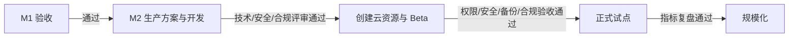

# AI Native 工程标准

> 版本：v1.0  
> 更新时间：2026-08-13  
> 状态：已确认，适用于本项目后续需求、开发、验证与交付

## 三窗口协作机制

### 需求定义窗口

- 负责讨论问题、澄清目标和形成产品判断。
- 未写入正式 `docs/` 的内容不视为开发指令。
- 对架构、权限、合规和范围有影响的判断必须转交资料文档窗口沉淀。

### 资料文档窗口

- `docs/` 是唯一有效需求基线。
- 维护版本、决策编号、范围、非范围、验收标准、变更日志和待确认项。
- 新结论必须区分已确认、待确认和已废止，不静默覆盖历史决策。
- 资料更新不等于自动授权主线切换任务；需明确开工或变更授权。

### 主线任务窗口

- 只按已确认 `docs/` 开发，不自行发明业务规则。
- 每轮先阅读与任务相关的 `docs/`、`design.md`、`AGENTS.md`、`TASKS.md`；文件不存在时记录缺失，不凭空假设其内容。
- 开始前明确目标、范围、非范围、验收条件和预计变更文件。
- 完成后执行工程检查、构建、浏览器回归并归档证据。
- 发现业务歧义立即回资料任务，不自行扩展产品边界。

## 变更治理

以下变化必须先记录决策，再实施：

- 产品规则、信息架构和页面职责。
- 数据模型、权限与组织隔离。
- 合规、隐私、安全和 AI 治理。
- 线上部署、云资源、域名、环境和运维策略。

纯视觉 Bug 可在不改变信息架构和业务行为的前提下直接修复，但必须自测并记录验证证据。

任何单页面还原不得修改父级信息架构，除非 `docs/` 明确授权。当前测试合同：

- `/console`：统一后台首页，不得被编辑器替换。
- `/console/content/new`：发布编辑器。
- `/preview`：内部项目全景和演示导航，不进入对外交付产品层级。

## 标准任务合同

每个任务必须包含：

1. 目标。
2. 范围与非范围。
3. 验收条件。
4. 计划/实际变更文件。
5. 验证命令和浏览器/截图/日志证据。
6. 风险、遗留和待确认事项。

## 工程执行标准

- 保持变更最小且与任务一致，不顺手改无关页面。
- 保护用户已有变更；遇到重叠修改先检查再行动。
- 使用 Git 分支与有意图的提交作为可回滚里程碑；当前脏工作区暂不强制提交或重组。
- 构建、类型检查和测试采用项目现有命令；缺失命令时先记录，不虚构通过结果。
- 视觉变更至少验证目标桌面宽度和移动宽度，并检查控制台错误。
- 证据应可追溯到任务、版本和验证时间。

## 稳定预览控制器标准

本地验收统一使用 stable preview controller，至少支持：

- `preview up`
- `preview status`
- `preview restart`
- `preview doctor`
- `preview logs`
- `preview down`

控制器需管理 PID、端口、日志位置和健康检查，避免重复服务或僵尸进程。测试和正式环境不得依赖本地预览控制器。

## AI 内容治理标准

涉及以下内容必须人工确认：事实不明确、未成年人、成果或效果、授权、合作关系、绝对化宣传、用户评价与肖像/版权。AI 可以提示、摘要、改写和生成建议，但永无最终公开发布权。

## 阶段闸门

- M1 验收后才进入 M2。
- M2 生产方案评审通过后才创建云资源。
- Beta 通过权限、安全、备份、恢复和合规验收后才进入正式试点。

## 完成定义

“完成”不是页面看起来接近，而是需求、代码、验证和证据一致；未验证事项必须显式报告，不能用推测代替结果。

