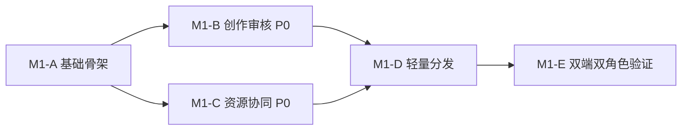

# M1 产品架构与实施方案

> 版本：M1 产品架构与实施方案 v0.4（已确认）  
> 更新时间：2026-08-13  
> 适用阶段：M1 本地 Demo  
> 状态：已于 2026-08-10 获用户批准并授权主线实施  
> 重要说明：本文件是当前主线实施依据；M2 生产化选项不属于 M1 开发指令，不得自行扩展。

> 工程执行遵循 [AI_NATIVE_ENGINEERING_STANDARD.md](./AI_NATIVE_ENGINEERING_STANDARD.md)，验收逐项对应 [ACCEPTANCE_MATRIX.md](./ACCEPTANCE_MATRIX.md)。M2 生产后端不属于本文件范围，见 [PRODUCTION_DELIVERY_AND_TECHNICAL_PLAN.md](./PRODUCTION_DELIVERY_AND_TECHNICAL_PLAN.md)。

## 目标

以最小可用闭环验证“总部资源供给—代理商创作/复用—总部治理—官网发布”的价值，不建设头条号、小红书级完整平台。

## 已确认架构前提

- 一个公开官网、一个统一内容协同后台。
- 代理商和总部共用同一内容/资源模型，通过演示角色切换呈现不同视图。
- M1 统一后台入口确认为 `/console`；正式环境可评估 `console.xinglu.zulonex.com`，后者仍非部署结论。
- 合肥是数据语境，不是全站重复标签。
- 页面严格遵循公司官网项目 `design.md`。

## M1-A：基础骨架

**目标**：建立统一平台边界和可演示的信息架构。

- 统一后台框架及代理商/总部演示角色切换。
- `/console` 保持为代理商默认首页；创作编辑器位于 `/console/content/new`，不得以编辑器替换后台首页。
- `/preview` 仅承担内部项目全景与演示导航，不进入对外交付产品层级。
- 公开官网与统一内容数据模型。
- 官方资源模型与内容来源/副本关系的基础结构。
- 合肥作为演示数据语境，通用文案不强加城市标签。
- 全站设计系统约束和统一 Demo 标识。

**完成标志**：两种角色进入同一后台后看到符合权限的首页、菜单与操作；公开端只展示已发布内容。

## M1-B：创作与审核闭环（P0）

当前主线优先完成 `/console/content/new` 发布编辑器最终还原；不得因 M2 生产方案资料更新停止当前工作或切换到新模块。侧栏字体视觉问题随本项修复并自测。

- 图文编辑、段落和一/二级标题、加粗、列表、引用、链接。
- 正文插图、多图排序/删除/说明、封面、本地上传或演示素材库。
- 草稿、桌面/移动预览。
- AI 风险提示演示。
- 总部审核、退回、代理商修改、重新提交、通过、公开发布、下架和操作记录。

**完成标志**：代理商可在 3 分钟内完成创建和送审；完整演示退回重提、发布及下架。

## M1-C：总部资源协同（P0）

- 代理商首页：核心动作、内容状态、热门活动、推荐课程、平台公告、优秀实践。
- 公告、活动、课程、优秀实践、官方内容和素材的演示资源卡。
- 官方内容库和素材中心演示。
- “直接使用/本地化修改”生成代理商自己的可编辑副本。
- 副本保留来源与版本关系；资源展示访问范围、使用方式和内容形式。
- 原样使用、范围匹配且无需补充本地事实的“可直接使用”资源免重复总部审核；发生修改或本地化则重新送审。

**完成标志**：代理商可从一条总部资源生成自己的内容副本，修改后进入同一审核链路。

## M1-D：轻量渠道分发演示（纳入 M1 验收）

- 已发布内容或官方内容生成公众号、小红书、朋友圈、抖音/视频号内容包。
- 复制文案、下载素材的演示交互。
- 不接真实账号、自动发布 API 或真实数据回传。

**完成标志**：一条已发布内容可生成多渠道演示包并完成复制/下载动作。

## M1-E：验证

- 验证桌面端和移动端。
- 验证代理商与总部两种角色视图。
- 验证四条关键闭环：自主创作发布、官方内容复用、退回修改、官网发布后生成渠道包。
- 检查 `design.md`、Demo 标识、AI/合规边界和错误文案。
- 检查合肥只出现在地域相关位置。

### 自动匹配的验收安排

- **执行负责人**：主线任务负责实现、自测、构建验证和演示准备。
- **资料核验负责人**：资料文档窗口依据 v0.4 检查需求覆盖、术语、Demo 标识与待确认项边界。
- **最终验收人**：用户。
- **验收日期**：不预设虚假固定日期；主线完成 M1-A 至 M1-E 并提交验证结果之日自动成为“提请验收日”，默认当日进入用户验收。
- **演示方式**：本地浏览器现场演示为主，覆盖桌面端和移动端、代理商和总部角色、四条关键闭环；同时提供录屏或关键流程截图作为备份证据。
- **提请验收条件**：相关检查通过、已知未完成项明确列出、无阻断级错误，且 M1-D 已完成演示验证。

## M1 不在范围

- 真实登录、组织体系、多级区域权限。
- 真实 CRM、对象存储、事实库和授权存证系统。
- 真实 AI 服务、真实社媒 API 和自动发布。
- 完整课程体系、考试、积分和证书。
- 社区、私信、评论、粉丝、排行榜。
- 收益、提现、直播和复杂数据看板。
- 云部署、域名解析、搜索收录和批量城市站点。

## 实施依赖与顺序

M1-B 与 M1-C 可在 M1-A 完成后并行推进，但不得跳过统一模型、角色视图和来源版本关系约束。

## M2 待确认项

M1 当前执行不再等待本文件中的业务选择。正式后台域名、登录方式、云资源、数据库、AI 供应商及 Beta 方案统一转入 [PRODUCTION_DELIVERY_AND_TECHNICAL_PLAN.md](./PRODUCTION_DELIVERY_AND_TECHNICAL_PLAN.md#待用户确认的生产化技术选项)，不得阻塞 P0-1 发布编辑器。
