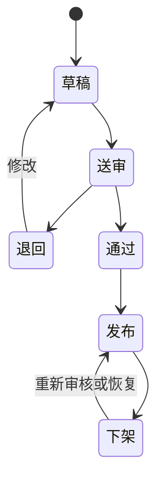
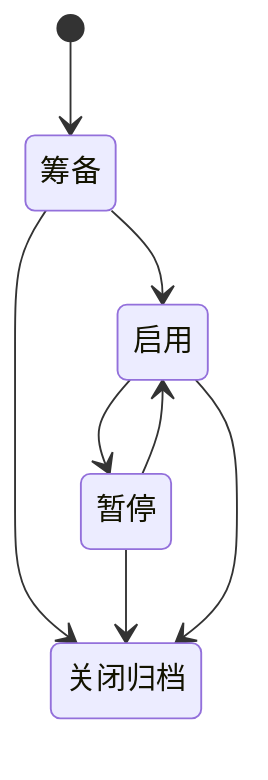

# 生产化交付与技术方案

> 版本：M2 生产化方案 v0.1  
> 更新时间：2026-08-13  
> 适用阶段：M2 方案评审、生产 Beta 与正式试点  
> 状态：产品架构与交付模型已确认；云资源、供应商、容量、地域与预算待确认  
> 边界：本文不是立即开发、采购、部署或域名解析指令

## 已确认的交付模型

本项目是总部统一建设、统一运营的一套系统，不为每个代理商复制部署独立网站、后台、服务器或数据库。

- 业务产品：逐鹿未来&星鹿爱学 三端导学 AI 成长系统。
- 对外平台表述：城市服务官网与内容协同平台。
- 内部简称：逐鹿 GEO AI 内容中台。
- 每位代理商获得经授权的“官网空间/服务范围 + 后台账号 + 授权资源包”，不获得服务器或数据库所有权。
- 总部统一拥有公开官网体系、协同后台、数据库、素材、审核、资源、日志及运维能力。
- 系统类似由总部管理全国虚拟服务门店：总部创建、开通、暂停或归档代理商官网空间，控制服务点、内容可见范围和资源授权。
- 代理商只可维护授权运营范围内的数据，不能查看、修改或发布其他代理商内容。
- 城市是数据和服务范围上下文，不是所有公开页面的重复标签。

## 代理商交付产品

- 经授权的官网空间：服务页、内容、活动和咨询入口。
- 后台账号与组织/服务范围权限。
- 官方资源包、运营规则和培训资料。
- 可选的渠道分发内容包。
- 后续可选的 CRM 线索能力。

代理商获得的是使用权和运营权限。平台基础设施、数据管理权、安全运维责任由总部统一承担；代理商对其提交的事实、素材和授权真实性承担相应责任。

## 总部运营产品

- 账号、组织、官网空间和资源授权控制。
- 内容审核、退回、通过、发布、下架及风险/操作记录。
- 官方公告、活动、课程、优秀实践、内容和素材。
- 品牌、合规、培训和运营支持。
- 统一数据、备份、监控、恢复和应急处理。

## 平台基础设施

生产后端至少需要：

1. 应用服务与后端 API。
2. 身份认证、会话管理与 RBAC。
3. 关系型数据库：账号、组织、官网空间、内容、审核、资源、任务、日志与线索。
4. 对象存储：图片、视频、附件及必要的版本信息。
5. AI 服务：初审、改写、风险摘要；AI 永无最终公开发布权。
6. 异步任务与通知。
7. 应用日志、监控、告警、备份、恢复和审计。
8. 安全、最小权限、组织/运营范围隔离和越权测试。

## 统一数据与权限边界

所有代理商内容和总部资源共用统一内容与权限模型，通过 `organizationId`、官网空间、运营范围、资源访问范围和角色权限隔离。服务端必须执行权限判断；前端隐藏菜单不能替代服务端授权。

最低核心实体建议：用户、组织、角色、运营范围、官网空间、服务点、内容、内容版本、审核记录、官方资源、资源授权、素材、分发任务、通知、线索、操作日志。

## 状态机

### 内容状态机

AI 初审仅为送审前或总部审核中的辅助结果，不能独立将内容推进至“通过”或“发布”。

### 官网空间/代理商状态机

- 筹备：资料、授权和服务点尚未满足公开条件。
- 启用：账号与授权范围生效，官网空间可按规则公开。
- 暂停：停止新增公开发布或暂时隐藏相关入口，保留数据与审计。
- 关闭/归档：终止运营使用，保留法定或业务所需记录。

## 火山云部署判断

把当前 M1 前端 Demo 部署至火山引擎不等于上线可运营系统。M1 使用模拟数据，无法提供真实登录、持久化、权限隔离、素材存储、审核日志、备份和生产审计。

M2 建议采用简化起步架构，不引入 Kubernetes：

- 应用容器或虚拟机。
- 托管 PostgreSQL 或 MySQL。
- TOS 对象存储。
- HTTPS 证书。
- 日志、监控、告警、备份与恢复。
- 测试、正式两个隔离环境。

火山引擎具体产品、机型、容量、地域、网络、数据库类型和预算必须在生产方案评审后选择，本文不写死。

### 域名与备案边界

- 域名可继续在阿里云管理，DNS 管理商与应用托管商可以不同。
- 若网站由火山引擎中国大陆服务器托管，即使此前已通过其他服务商取得 ICP 备案号，仍需依据实际接入关系核验并办理火山引擎接入备案；多接入商可按实际情况并存。[火山引擎：接入备案流程](https://www.volcengine.com/docs/6428/71557?lang=zh)
- 中国大陆服务器对外提供网站服务前需完成适用的备案流程，不应在备案完成前开放访问。[火山引擎：常见备案场景](https://www.volcengine.com/docs/6428/68760?lang=zh)
- 上线后应按要求展示备案号；公安联网备案的适用要求和时间应在正式上线前由合规人员结合主体、地域和业务复核。[火山引擎：备案完成 FAQ](https://www.volcengine.com/docs/6428/141467)
- 经营性 ICP 许可、教育业务相关许可、地方管局规则和公安备案的具体适用性均待合规确认，本文不作法律承诺。

当前不购买云资源、不部署、不解析域名。

## 责任边界

| 主体 | 主要责任 |
|---|---|
| 总部 | 系统建设、账号授权、品牌与合规治理、数据安全、运维、备份、监控、应急 |
| 代理商 | 授权范围内运营，提交事实与素材真实性，遵守内容和资源使用规则 |
| AI 服务 | 提供辅助检查和生成，不承担终审与公开发布决定 |
| 云服务商 | 按采购服务协议提供基础设施能力，不代替总部承担业务合规责任 |

## 待用户确认的生产化/技术选项

- 火山引擎是否为正式首选云服务商，是否需要多云/迁移预案。
- 中国大陆部署地域、测试/正式环境规模、预算上限和采购主体。
- PostgreSQL 或 MySQL 的最终选择及高可用/备份等级。
- 身份认证方式：自建账号、企业微信/手机号、统一身份平台或组合方式。
- 正式域名、后台域名和官网空间 URL 规则。
- 对象存储访问策略、CDN/图片处理需求和数据保留周期。
- AI 模型/供应商、数据使用边界、日志保留与成本预算。
- 异步任务、通知渠道和 CRM 接入优先级。
- Beta 真实主体名单、授权材料、试点指标与支持 SLA。
- 经营性许可、教育业务、ICP备案和公安联网备案的正式合规意见。

