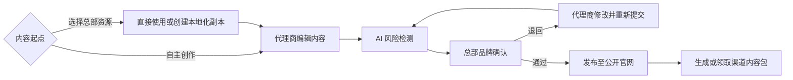

# 产品架构

> 版本：M1 产品架构与实施方案 v0.4（已确认）  
> 更新时间：2026-08-10  
> 适用阶段：M1 本地 Demo  
> 状态：已于 2026-08-10 获用户批准并授权主线实施  
> 基线关系：v0.3 仅保留为历史事实；v0.4 已替代 v0.3 的“五部分产品化”表达

## 已确认替代架构

### 产品与平台层级

| 层级 | 正式定义 |
|---|---|
| 业务产品 | 逐鹿未来&星鹿爱学 三端导学 AI 成长系统 |
| 面向外部的平台表述 | 城市服务官网与内容协同平台 |
| 内部平台名称 | 逐鹿 GEO AI 内容中台 |

“三端导学”是业务/教育服务概念，描述业务服务体系，不是本平台的信息端划分，不能与公开端、代理商角色视图、总部角色视图混淆。

### 数字平台形态

平台不是五个独立产品，而是：

1. **一个公开官网**：唯一独立公开端，展示总部确认并发布的可信内容。
2. **一个统一内容协同后台**：代理商与总部共用同一后台、同一内容数据模型和同一资源模型。
3. **两种角色权限**：通过 RBAC 视图呈现代理商与总部不同的菜单、首页、动作和数据范围。M1 仅演示角色切换，不建设真实权限系统。
4. **一条品牌治理发布链路**：创作/复用—编辑本地化—AI 风险检测—总部确认—公开发布—渠道内容包。

AI 风险检测、渠道分发、事实库和 CRM 是平台能力或后续数据底座，不是 M1 的独立系统。

### 统一后台定位

统一后台是“逐鹿未来面向代理商的内容运营、培训赋能与品牌协同平台”。

**代理商角色可见能力**：

- 自主创作官网内容。
- 领取总部官方内容、活动方案、培训课程、品牌素材与优秀实践。
- 直接使用、下载/复制，或本地化修改后送总部确认。
- 获取朋友圈、小红书、公众号、抖音/视频号内容包；M1 只做轻量演示，不接平台 API。

**总部角色可见能力**：

- 审核、退回、通过、发布和下架。
- 发布官方内容、公告、活动、课程、素材与优秀实践。
- 上传并管理供代理商学习的视频、图片、图文和 PDF 培训资料；已启用资料同步进入代理商学习中心。
- 配置内容资源的访问范围与使用方式。
- 进行品牌风险治理和后续分发管理。

### 已确认入口与信息架构

- M1 统一后台入口：`/console`（已确认）。
- `/console` 默认展示代理商后台首页；“发布内容”进入 `/console/content/new` 的沉浸式编辑器，返回动作回到代理商后台首页。
- `/preview` 是总部项目管理、研发联调与 Demo 演示使用的“项目全景”，不是代理商后台主页，不属于对外交付产品的信息架构。
- 正式环境可评估：`console.xinglu.zulonex.com`。
- 正式环境域名仍是待确认建议，不是部署结论。
- v0.3 的 `/publish`、`/ops`、`/ops/distribution` 不再被视为三个分立产品入口；若保留，只能作为统一后台内的兼容路由或模块路径，需另行确认。

### 代理商首页

首页参考自媒体创作服务平台的清晰行动导向，不复制其高信息密度和复杂功能：

- 顶部核心动作：发布内容、使用官方内容、查看需要修改。
- 内容状态：草稿、审核中、需要修改、已发布。
- 热门活动：代理商培训、招商会、主题/节日/家长体验活动。
- 推荐课程：经销商培训、产品使用、服务流程、家长沟通、内容发布与合规。
- 平台公告：普通、重要、需确认。
- 优秀实践：伙伴运营案例、城市活动案例、服务实践、已获授权的家长反馈/客户故事。

栏目统一命名为“优秀实践”，伙伴案例与家长反馈保留类型区分，不混为同一事实类型。

### 代理商侧菜单

菜单固定为八项：

1. 首页
2. 发布内容
3. 内容管理
4. 官方内容库
5. 素材中心
6. 学习中心
7. 分发任务
8. 消息通知

数据概览放在首页或内容管理，不建设复杂独立数据中心。

### 官方资源模型

资源类型：公告、活动、课程、官方内容、优秀实践、素材。

| 维度 | 可选值 |
|---|---|
| 访问范围 | 全部代理商 / 指定区域 / 指定代理商 / 仅总部 |
| 使用方式 | 可直接使用 / 建议本地化 / 需要补充事实 / 仅供学习 / 已停用 |
| 内容形式 | 图文 / 图片 / 视频 / 附件 / 渠道内容包 |

资源规则：

- 外地案例不能包装为本地真实案例。
- 家长反馈必须具备授权；涉及学生信息必须去标识化。
- “直接使用”和“本地化改写”保留来源与版本关系。
- 标记“可直接使用”的官方资源，在内容未修改、适用范围匹配且不需要补充本地事实时，可免重复总部审核；一旦修改、本地化或补充事实，必须重新进入总部确认链路。
- 首阶段“相互连接”是经过总部治理的资源、经验和活动共享，不建设私信、评论社区、关注关系或公开排名。

### 品牌治理发布链路

### 城市化表达

合肥市是 M1 的真实地理语境和演示范围，不是全站重复宣传标签。城市仅用于城市切换、服务范围、服务点、活动地点、联系方式、地域内容和页面元信息。产品介绍、通用服务方法、通用栏目与主体文案不强制添加城市前缀。所有门店、代理商、学生、案例和联系方式仍为虚拟 Demo 数据并明确标识。

## 待用户确认

- 正式环境是否采用 `console.xinglu.zulonex.com`，仅作为后续评估项。
- M1 角色切换的演示方式及默认角色。

## M1 当前不做

- 真实 RBAC、登录、组织体系和多级区域权限。
- 真实 AI、CRM、事实库、对象存储和社媒 API。
- 独立 AI 系统、独立分发系统或独立 CRM 系统建设。
- 社区、私信、评论、关注关系和公开排名。
