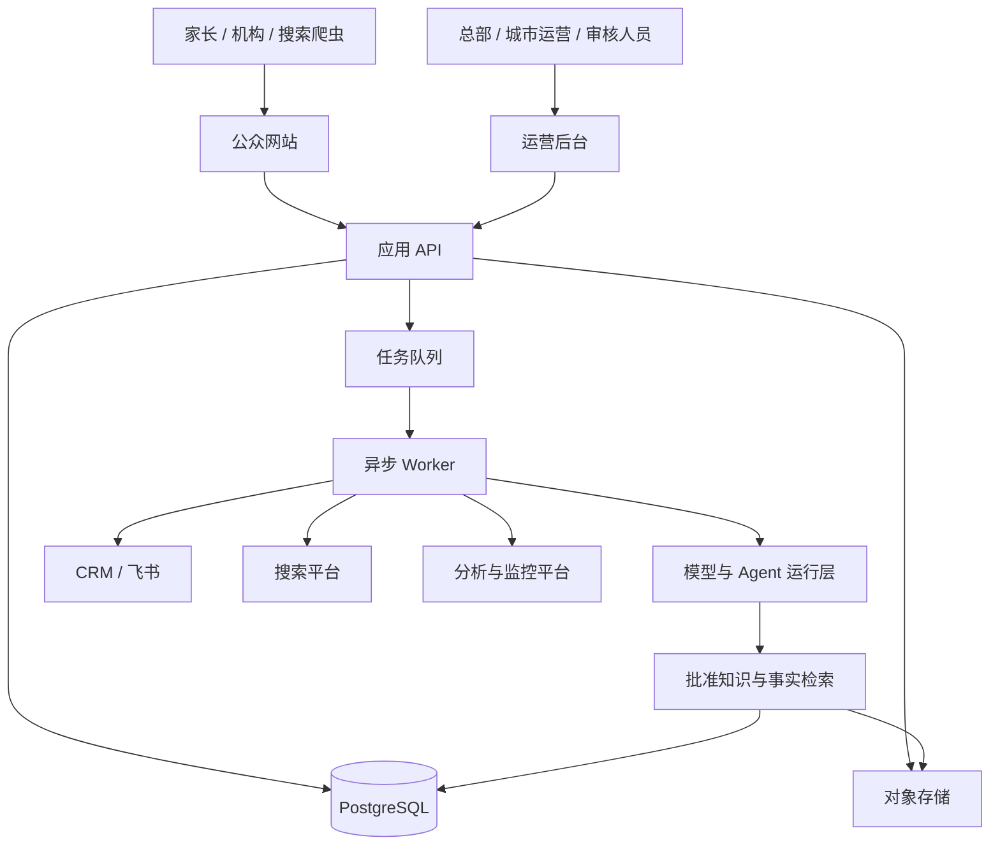
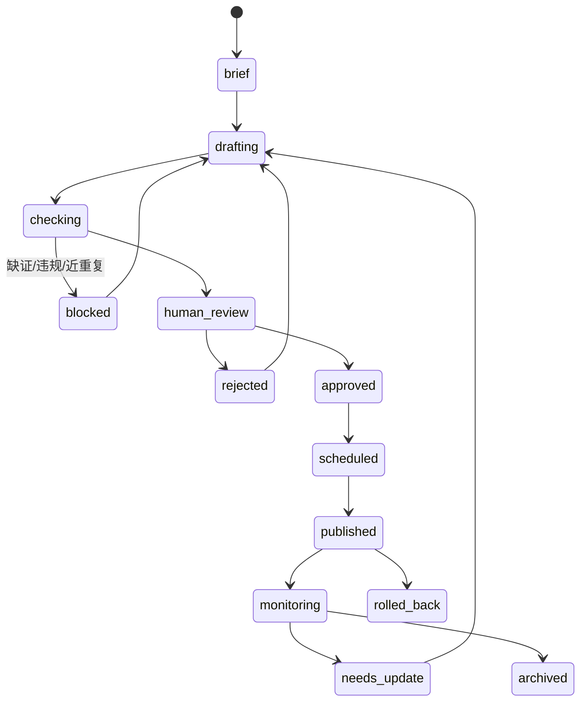
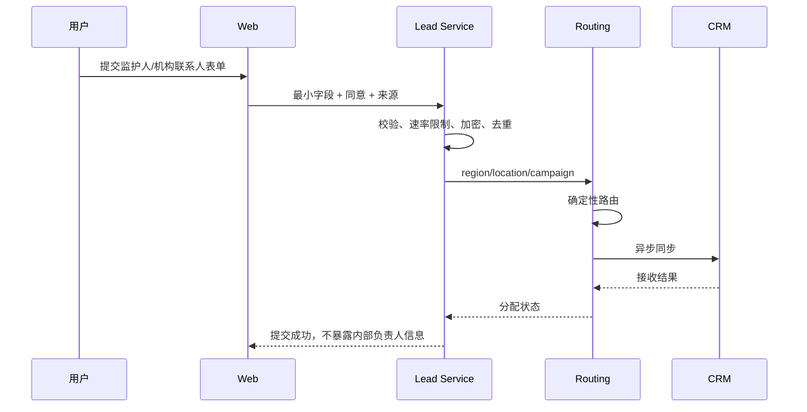

# 逐鹿未来项目官网矩阵：MVP 技术架构

> 版本：v1.0  
> 日期：2026-07-30  
> 上游需求：[官网矩阵项目需求与 AI Agent 策略](./官网矩阵项目需求与AI-Agent策略-v1.md)  
> 状态：独立项目仓库建立前的技术评审基线

## 1. 架构结论

MVP 采用“模块化单体 + 独立异步 Worker”，不在首期引入微服务。

```text
独立项目域名
  -> Web 应用（公众网站 + 运营后台 + 受控 API）
  -> PostgreSQL（业务事实源）
  -> 对象存储（图片、视频、授权与证据文件）
  -> Redis/任务队列（发布、AI、同步、监控任务）
  -> Worker（AI Agent、Sitemap、CRM 同步、监控）
  -> 外部系统（CRM/飞书、搜索平台、分析平台、模型服务）
```

建议使用 TypeScript 单仓库，公众网站与运营后台共享类型、权限、数据访问和发布状态。部署必须支持国内自托管，不绑定单一云厂商或单一模型供应商。

## 2. 架构目标

- 一个代码库承载主站、城市、门店和内容页面；
- 一个数据库维护城市、门店、事实、内容和线索；
- 页面由结构化数据生成，不复制站点；
- 允许静态生成、按需重建和服务端渲染组合；
- AI 只通过受控工具读写，不直接接触生产数据库权限；
- 内容生成、审核、发布、索引和回滚全链路可追踪；
- PII 与内容知识库隔离；
- 可从 10–20 个城市平滑扩展到数千行政区域记录；
- 城市数据量增长不等于索引页面同步增长。

## 3. 关键技术决策

### ADR-001：独立项目、独立仓库

- 新官网使用独立域名和独立 Git 仓库；
- 不与 `zulonex.com` 公司官网共用路由、环境变量或部署；
- 可以迁移现有项目素材和通用组件，但必须保留来源与授权记录；
- 当前仓库仅保存规划文档，正式实现时创建新工程。

### ADR-002：单域名路径优先

默认：

```text
/locations/<province>/<city>/
/stores/<store-slug>/
```

原因：

- 集中搜索与品牌信号；
- 避免数千子域名的证书、DNS、监控和 Search Console 维护；
- 统一登录、分析、缓存和发布；
- 城市页面天然处于可浏览的信息层级；
- 重点城市未来仍可通过反向代理映射子域名。

### ADR-003：模块化单体优先

首期模块：

- Identity/RBAC；
- Region/Location；
- Claims/Evidence；
- Content/Publishing；
- AI Workflow；
- Leads/Routing；
- Analytics/Monitoring；
- Audit/Compliance。

模块间通过明确的服务接口和事件通信，不直接跨模块修改表。达到真实扩容瓶颈后再拆分服务。

### ADR-004：PostgreSQL 为事实源

- 行政区域、门店、事实、内容状态、审批和线索均以 PostgreSQL 为权威数据；
- 页面正文使用受 Schema 约束的 JSON 内容块；
- 搜索和向量能力首期可使用 PostgreSQL 扩展或外部检索服务；
- 不把向量库作为事实源；
- CRM、分析和搜索平台均为下游系统。

### ADR-005：AI 不拥有发布权

- Agent 可以创建 Brief、草稿、检查结果和发布请求；
- Agent 不可以直接设置 `published` 或 `indexable`；
- 发布服务必须验证审批记录、内容版本、事实有效性和索引门禁；
- 所有高风险页面始终需要人工审批；
- 未来低风险自动更新也必须通过 Eval、灰度和可撤销授权。

### ADR-006：PII 与内容 Agent 隔离

- 联系人姓名、手机、聊天内容和学生信息不进入内容 Agent 上下文；
- Lead 模块使用应用层加密和最小权限；
- Agent 只读取聚合、脱敏的转化指标；
- trace、日志和错误信息默认不记录模型输入中的个人信息。

## 4. 系统上下文



## 5. 推荐工程形态

正式仓库建议：

```text
project-matrix/
├── apps/
│   ├── web/                 # 公众站、运营后台、受控 API
│   └── worker/              # AI、发布、同步、监控任务
├── packages/
│   ├── db/                  # Schema、迁移、数据访问
│   ├── domain/              # 领域类型、状态机、业务规则
│   ├── content-schema/      # 内容块、SEO、结构化输出 Schema
│   ├── agents/              # Agent、工具、guardrail、eval
│   ├── ui/                  # 设计系统与通用组件
│   ├── analytics/           # 事件字典和 SDK
│   └── config/              # lint、TypeScript、测试配置
├── docs/
│   ├── ARCHITECTURE.md
│   ├── DECISIONS.md
│   ├── QUALITY_GATES.md
│   └── RUNBOOKS/
├── scripts/
│   ├── setup.sh
│   ├── dev.sh
│   └── check.sh
├── tests/
│   ├── e2e/
│   ├── fixtures/
│   └── evals/
├── PROJECT_CONTEXT.md
├── AGENTS.md
└── TASKS.md
```

### 推荐技术类别

| 层 | 建议 | 说明 |
| --- | --- | --- |
| Web | Next.js App Router（建议默认方案） | 公众站、后台、SSR/预渲染和 Route Handlers |
| 数据库 | PostgreSQL | 关系、JSON 内容块、全文/向量扩展 |
| ORM/迁移 | 类型安全 ORM + SQL migration | Schema 以 migration 为准 |
| Worker/队列 | Node.js TypeScript + Redis 兼容队列 | AI、发布、同步、重试 |
| 对象存储 | S3/OSS 兼容 | 媒体、证据、授权原件 |
| AI | Responses API/Agents SDK 或等价抽象 | 必须包在自有 Provider 接口后 |
| Schema | JSON Schema + TypeScript 校验层 | 页面块、工具输入输出、事件统一 |
| 测试 | 单元/集成 + 浏览器 E2E + Agent Eval | 业务规则和 Agent 同时受测 |
| 观测 | OpenTelemetry 兼容日志、指标、trace | 与业务审计日志分离 |
| 部署 | Docker + CDN/反向代理 | 国内自托管与多云可迁移 |

Next.js 是当前默认建议，因为 App Router 可将公众页面、后台页面和受控
Route Handlers 放在同一 TypeScript 应用中，并支持 Node/Docker 自托管。官方
自托管指南建议在服务前使用反向代理，并要求多实例部署时统一缓存和构建配置：

- https://nextjs.org/docs/app
- https://nextjs.org/docs/app/getting-started/route-handlers
- https://nextjs.org/docs/app/guides/self-hosting

不锁定具体框架版本。正式建仓时仍需通过 ADR 确认团队熟悉度、国内部署、
缓存策略和升级责任；如果团队明确以 Astro 为主，也可保留相同领域架构，
将运营后台和 API 独立为一个 TypeScript 应用。

## 6. 领域模块

### 6.1 Identity 与 RBAC

职责：

- 用户、角色、城市和门店权限；
- 总部、内容、合规、SEO、城市运营、门店和系统管理员角色；
- 高风险操作二次审批；
- 登录、会话、停用和审计。

关键规则：

- 城市运营人员只能编辑授权城市；
- 门店人员只能访问本门店线索和公开数据；
- Agent 服务账户无生产发布权限；
- 审批人不能审批自己提交的高风险内容。

### 6.2 Region 与 Location

职责：

- 全国行政区域树；
- 城市业务状态和索引状态；
- 门店/服务中心；
- 服务范围、负责人和联系方式；
- 数据完整度与最后核验时间；
- 媒体和授权状态。

关键状态：

```text
data_only
  -> serviceable_noindex
  -> verified_draft
  -> index_candidate
  -> indexable
  -> paused / retired
```

业务状态与搜索索引状态分开保存，避免“可服务”自动等于“可索引”。

### 6.3 Claims 与 Evidence

职责：

- 品牌、产品、团队、授权、业务数据、案例和城市事实；
- 每条事实的证据、允许文案、禁止扩写、适用范围和有效期；
- 事实冲突、过期提醒和审批；
- 供内容 Agent 和审核页面引用。

内容中的可核验陈述应引用 Claim ID。高风险事实缺少有效证据时，发布服务必须阻断。

### 6.4 Content 与 Publishing

职责：

- 内容 Brief、内容项、版本、内容块；
- 页面类型、受众、意图、作用域和 canonical；
- 草稿、检查、审批、排期、发布、更新和归档；
- 页面快照、版本对比和回滚；
- Sitemap、robots、redirect 和结构化数据。

正文不直接保存任意 HTML，而保存受 Schema 约束的内容块，例如：

```json
{
  "type": "local_service_overview",
  "regionId": "region-id",
  "heading": "合肥星鹿爱学服务",
  "body": "经审核的正文",
  "claimIds": ["claim-id"],
  "sourceIds": ["evidence-id"]
}
```

### 6.5 AI Workflow

职责：

- 编排 Agent 和专业 Agent；
- 工具调用、上下文裁剪和来源检索；
- Prompt、模型、Schema 和工作流版本；
- AI finding、trace、成本和运行状态；
- Eval、灰度和回归；
- 发布请求，不负责最终发布。

### 6.6 Leads 与 Routing

职责：

- 表单提交和同意记录；
- 来源页面、城市、门店、UTM 和活动归因；
- 去重、反垃圾和速率限制；
- 按确定性规则分配；
- CRM/飞书同步和重试；
- 跟进事件与保留期限。

线索路由不由模型自由判断。无法匹配时进入总部公共池，由人工处理。

### 6.7 Analytics 与 Monitoring

职责：

- 页面、CTA、表单和线索漏斗事件；
- 抓取、索引、曝光、点击和内容健康；
- 城市/门店/内容维度报表；
- 事实过期、授权到期和异常数据告警；
- 提供脱敏聚合数据给监控 Agent。

### 6.8 Audit 与 Compliance

职责：

- 谁在什么时间查看、修改、审批、发布和回滚；
- 合规规则、阻断项、例外审批和依据；
- AI 运行与内容版本关联；
- 数据导出、删除和权限变更审计。

业务审计日志不可被普通管理员修改。

## 7. 内容与发布状态机



每次状态变更必须保存：

- 操作者；
- 内容版本；
- 原状态和目标状态；
- 理由；
- 关联审核或审批；
- 时间；
- 自动/人工来源。

## 8. Agent 工具契约

工具返回结构化结果，工具本身执行权限、范围和 Schema 校验。

### 8.1 只读工具

`search_approved_knowledge`

```json
{
  "query": "三端导学如何协作",
  "scope": ["brand", "product"],
  "limit": 10
}
```

返回 Claim/Evidence ID、摘要、有效期和适用范围。

`get_region_readiness`

```json
{
  "regionId": "uuid"
}
```

返回必填字段、缺失字段、证据状态、业务状态和索引状态。

`get_content_performance`

仅返回聚合指标，不返回联系人 PII。

### 8.2 草稿工具

`create_content_brief`

- 接受受众、意图、页面类型、作用域和 Claim ID；
- 创建 `brief` 状态记录；
- 不允许设置 published/indexable。

`save_content_draft`

- 必须指定内容项、基础版本和 JSON Schema 版本；
- 乐观锁避免覆盖人工编辑；
- Claim ID 不存在或已失效时拒绝。

`record_ai_finding`

- 类别：fact、seo、compliance、privacy、copyright、quality；
- 严重性：info、warning、blocker；
- 必须定位到内容字段或内容块；
- blocker 未关闭时不得提交发布。

### 8.3 受限动作

`submit_for_review`

- 仅把完整草稿提交审核；
- 检查所有必需的 Agent/程序检查是否完成；
- 不发布。

`request_publication`

- 创建发布请求；
- 必须引用已批准内容版本；
- 生产执行仍由发布服务和人工审批控制；
- 高风险内容不支持 Agent 自动请求免审。

### 8.4 禁止向 Agent 暴露

- 任意 SQL；
- 生产数据库写连接；
- 原始线索导出；
- 用户密码、密钥和访问令牌；
- 任意 Shell；
- 绕过审批的发布接口；
- 批量删除和批量重定向。

## 9. 内容发布流程

1. 业务人员创建选题或城市上线任务；
2. 系统检查城市/门店准备度；
3. 事实 Agent 输出证据表；
4. 搜索意图 Agent 判断新增、合并或拒绝创建；
5. 内容 Agent 生成结构化 Brief 和草稿；
6. 程序执行 Schema、链接、字段、哈希和基础重复检查；
7. 专业 Agent 执行事实、搜索质量和合规检查；
8. 阻断项清零后进入人工审核；
9. 审核通过创建发布请求；
10. 发布服务校验审批、版本、事实有效期和索引门禁；
11. 生成页面、缓存、Sitemap 和监控记录；
12. Worker 同步搜索平台、CRM 和分析平台；
13. 监控 Agent 生成更新建议。

任何步骤失败都不得跳过中间状态。

## 10. 渲染与缓存策略

### 10.1 页面类型

- 品牌与产品核心页：构建时生成或按需重建；
- 城市和门店页：数据更新后按需重建；
- 内容文章：审批发布后按需重建；
- 搜索/筛选：服务端渲染，默认不索引；
- 运营后台：服务端动态；
- 预览页：带鉴权、`noindex`、禁止缓存。

### 10.2 缓存失效

发布事件包含：

```json
{
  "contentItemId": "uuid",
  "paths": ["/locations/anhui/hefei/"],
  "sitemapGroups": ["regions-anhui"],
  "reason": "content_published",
  "version": 12
}
```

消费者必须幂等处理。失败进入重试和死信队列，不允许因缓存失败回滚数据库已批准状态；页面发布状态与缓存状态分别记录并告警。

## 11. SEO 技术架构

- canonical 由 canonical registry 唯一生成；
- 页面作用域、URL 和索引状态必须一致；
- 城市、内容类型和更新时间维度拆分 Sitemap；
- Sitemap index 只引用成功发布的 Sitemap；
- `noindex` 页面不进入 Sitemap；
- 重定向由显式 redirect 表管理，避免链式跳转；
- 结构化数据由内容 Schema 和业务实体生成；
- 内链由信息层级和业务关系生成，不由模型随意添加；
- 页面显示事实更新时间；
- 搜索/筛选参数页默认 canonical 到稳定页面或 `noindex`；
- 404、410、暂停城市和合并城市有明确规则。

## 12. 线索流程



失败策略：

- CRM 不可用不影响前台成功保存；
- Outbox 保证可重试；
- 多次失败告警；
- 用户不因同步失败重复提交；
- 路由失败进入总部公共池。

## 13. 安全与隐私

### 13.1 数据分类

| 等级 | 示例 | 控制 |
| --- | --- | --- |
| Public | 已发布页面、公开门店电话 | CDN 可缓存 |
| Internal | Brief、草稿、运营指标 | 登录与角色权限 |
| Confidential | 合作条件、授权材料、未发布证据 | 最小权限、审计 |
| Sensitive PII | 联系人、未成年人信息 | 加密、单独权限、保留期限 |

### 13.2 技术控制

- 密钥只存在于 Secret Manager/运行环境；
- 数据库账户按 Web、Worker、只读分析分离；
- PII 应用层加密，去重使用不可逆 HMAC；
- CSRF、XSS、SQL 注入、SSRF 和文件上传防护；
- 表单限流、机器人检测和异常告警；
- 上传文件病毒检查、类型和尺寸限制；
- 外部抓取内容视为不可信，防 Prompt Injection；
- Agent 工具调用使用短期身份和作用域；
- 管理端关键操作启用二次确认；
- 审计日志只追加；
- 定期备份和恢复演练。

## 14. 可观测性

### 14.1 技术指标

- Web 请求错误率和延迟；
- 页面生成、缓存更新和 Sitemap 成功率；
- 队列深度、重试和死信；
- CRM 同步成功率；
- 数据库连接、慢查询和存储；
- Agent 运行成功率、延迟、Token 和成本；
- guardrail 阻断和工具权限拒绝；
- 发布/回滚耗时。

### 14.2 业务指标

- 城市准备度；
- 索引页面数与索引率；
- 内容通过率和退回原因；
- 页面到线索转化；
- 线索路由时效；
- 门店接受与跟进；
- 每条合格线索的内容和 AI 成本。

### 14.3 隐私原则

- 技术 trace 使用内部 ID，不记录联系人明文；
- Agent trace 默认对输入输出脱敏；
- 调试临时开放敏感日志必须审批并设置到期时间；
- 分析平台不发送姓名、电话、原始表单或完整 IP。

## 15. 环境与发布

环境：

```text
local -> preview -> staging -> production
```

要求：

- preview 使用匿名测试数据；
- staging 使用脱敏样本；
- production 数据不得复制到本地；
- 数据库 migration 先向后兼容，再发布应用，再清理旧字段；
- 生产发布支持蓝绿或滚动；
- 重要发布设置观察窗口；
- 内容发布与应用发布相互独立；
- 模型、Prompt 和工作流变更可单独灰度；
- 提供 Agent、自动发布和外部同步 Kill Switch。

## 16. 非功能验收基线

### 可靠性

- 发布、线索写入和外部同步幂等；
- 单个 Agent/外部服务故障不影响公众网站浏览；
- CRM 故障不丢线索；
- 内容可回滚到上一批准版本；
- 数据库和对象存储有备份与恢复演练。

### 性能

- 公众页面优先静态或边缘缓存；
- 城市规模增长不造成构建时间线性失控；
- 图片自动响应式处理；
- 搜索爬虫与用户访问有容量保护；
- 管理后台长任务全部异步。

### 可维护性

- 所有内容块、Agent 输出和 API 有版本化 Schema；
- 所有状态机有单元测试；
- 所有工具有权限测试；
- 所有外部系统通过 Adapter；
- 本地一条命令启动依赖；
- CI 覆盖 lint、typecheck、unit、integration、e2e 和 eval smoke。

## 17. MVP 部署单元

建议首期只部署：

1. `web`：公众站、运营后台、受控 API；
2. `worker`：队列任务、AI、发布和同步；
3. PostgreSQL；
4. Redis；
5. 对象存储；
6. CDN/反向代理；
7. 日志、指标和告警。

暂不引入：

- Kubernetes；
- 多区域数据库；
- 独立搜索集群；
- 数十个微服务；
- 自研向量数据库；
- 全自动发布；
- 面向用户的开放式 AI 聊天。

## 18. 建仓前必须确认

1. 项目正式名称和仓库名；
2. 独立域名和备案主体；
3. 国内部署云与数据区域；
4. Web 技术框架；
5. 登录与账号来源；
6. CRM/飞书目标；
7. 首批城市和门店数据；
8. 模型服务、数据出境和脱敏策略；
9. 内容、合规和发布审批人；
10. 预算、团队和 MVP 目标日期。
