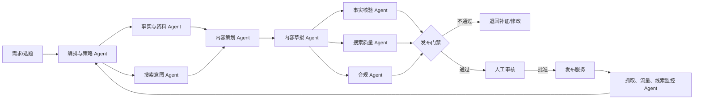

# 逐鹿未来项目官网矩阵：需求基线与 AI Agent 策略

> 版本：v1.0  
> 日期：2026-07-30  
> 状态：立项与方案评审基线  
> 说明：本项目是独立的“星鹿爱学 AI 智慧学习方案”项目官网矩阵，不是 `zulonex.com` 公司官网改版。

实施附件：

- [MVP 技术架构](./官网矩阵-MVP技术架构-v1.md)
- [页面、路由与埋点清单](./官网矩阵-页面路由与埋点-v1.md)
- [PostgreSQL Schema 草案](./官网矩阵-PostgreSQL-Schema-v1.sql)
- [MVP 开发 Backlog](./官网矩阵-开发Backlog-v1.md)

## 1. 结论摘要

本项目不采用传统的“复制 3000 多个网站 + 替换城市名”站群模式，而采用：

1. 一个独立项目域名；
2. 一个代码库与一套设计系统；
3. 一个总部内容与品牌知识库；
4. 一套覆盖全国行政区域、门店和代理商的结构化数据；
5. 按真实服务能力生成城市、门店和内容页面；
6. AI Agent 辅助研究、策划、生成、核验、审核和持续优化；
7. 确定性程序负责数据校验、页面渲染、Sitemap、线索路由和权限；
8. 高风险内容与正式发布由人工审批。

“3325 个城市/区县”首先是业务覆盖数据，不等于 3325 个立即上线、立即索引的网站。只有具备真实本地服务信息和用户价值的城市页面才进入搜索索引。

推荐 URL 结构：

```text
https://项目域名.com/
https://项目域名.com/locations/
https://项目域名.com/locations/anhui/hefei/
https://项目域名.com/stores/<store-id>/
https://项目域名.com/insights/<slug>/
https://项目域名.com/cooperation/
```

重点城市如未来确有独立运营、品牌和权限需求，可以映射独立子域名，但仍复用同一平台、数据库和发布流程。

## 2. 项目目标

### 2.1 业务目标

- 建立独立于逐鹿未来公司官网的项目品牌阵地。
- 清晰解释“星鹿爱学 + 三端导学 + 本地学习空间/合作机构”的价值。
- 形成家长体验和机构合作两条可衡量的转化路径。
- 将线上访问准确归因到城市、门店、内容和推广渠道。
- 将有效线索自动路由给对应门店、代理商或总部业务人员。
- 形成可以长期维护、持续积累的搜索和品牌数字资产。
- 支持官网、新媒体、线下门店和招商渠道协同。

### 2.2 搜索与 AI 可发现性目标

- 覆盖品牌词、产品词、问题词、场景词和真实本地服务词。
- 向搜索引擎和 AI 问答系统提供稳定、清晰、有来源的项目事实。
- 建立可被引用的品牌说明、产品机制、案例、FAQ、城市服务和门店事实页。
- 提升有效页面的抓取、收录、曝光、点击和转化，不以页面总量作为最终成果。

### 2.3 运营效率目标

- 总部一次维护品牌事实、规则和公共内容。
- 城市运营人员只维护本地事实和素材，不复制整站。
- AI 缩短资料整理、选题、内容初稿、质量检查和更新诊断时间。
- 所有发布内容具有来源、责任人、审核记录、版本和回滚能力。

### 2.4 非目标

- 不以操纵搜索排名为目的批量制造城市页。
- 不承诺固定收录数量、固定排名或固定收录周期。
- 不让 AI 自动编造门店、案例、荣誉、效果、价格或投资回报。
- 不用 AI Agent 代替 CRM、权限系统、数据库和确定性业务规则。
- 不默认采集学生学习数据，不将未成年人敏感信息用于内容生成。

## 3. 用户与转化路径

### 3.1 家长与学生家庭

核心问题：

- 这是什么学习方案？
- AI、导学老师和家长如何协作？
- 适合什么学习场景？
- 本地是否有可以体验或咨询的服务点？
- 产品边界、服务流程和费用如何？

目标动作：

- 预约体验；
- 咨询本地门店；
- 获取项目资料；
- 查看真实案例与常见问题。

原则：网站表单主要面向监护人，不主动要求未成年人直接提交个人信息。

### 3.2 教育机构与联营合作方

核心问题：

- 适合哪些机构和场地？
- 总部提供什么产品、培训、运营与交付支持？
- 合作流程、双方责任和风险是什么？
- 是否有可以核验的落地案例？

目标动作：

- 预约项目演示；
- 提交机构合作需求；
- 进入资质评估和业务跟进。

原则：招商和收益相关表达必须可证明，不使用保证收益、无风险、最佳、第一等高风险表述。

### 3.3 门店、代理商与城市运营人员

核心任务：

- 维护门店地址、电话、营业时间、服务范围和现场素材；
- 提交本地活动、案例和 FAQ 事实；
- 接收、跟进和反馈本地线索；
- 查看本地流量与转化；
- 对需要更新或失效的页面负责。

### 3.4 总部团队

角色包括：

- 品牌与内容负责人；
- 产品与交付专家；
- SEO/GEO 运营；
- 法务/合规审核；
- 招商与门店运营；
- 系统管理员。

总部负责品牌事实、发布规范、权限、审核、指标和全局数据，不逐站手工维护页面。

## 4. 城市矩阵策略

### 4.1 城市状态模型

| 状态 | 含义 | 是否公开 | 是否索引 |
| --- | --- | --- | --- |
| 数据占位 | 仅建立行政区域记录 | 否 | 否 |
| 可服务城市 | 可由总部或邻近区域提供咨询，但本地事实不足 | 可选 | 默认否 |
| 已验证运营城市 | 有真实负责人、联系方式、服务内容和有效素材 | 是 | 可申请 |
| 标杆城市 | 有门店、团队、案例、活动和持续内容能力 | 是 | 是，重点运营 |
| 暂停/失效城市 | 服务暂停或数据过期 | 保留说明或下线 | 否 |

从 `noindex` 切换为 `index` 必须满足发布门禁，并经过 SEO/运营人员审批。

### 4.2 城市页面最低发布门禁

以下字段必须真实、可验证且在有效期内：

- 城市及服务范围；
- 服务主体或负责团队；
- 有效咨询方式；
- 真实服务内容；
- 本地门店信息，或明确说明由哪个服务中心承接；
- 至少一组有授权的本地图片或活动素材；
- 更新日期和内容责任人；
- 隐私政策、投诉反馈和主体信息链接。

进入索引还应至少满足以下一项：

- 真实门店；
- 本地负责人和稳定服务能力；
- 可核验的本地案例；
- 持续开展的本地活动；
- 对该城市用户具有显著独立价值的服务说明。

仅替换城市名、电话和首段的页面不得进入索引。

### 4.3 城市页面内容模块

- 城市服务概览；
- 本地可提供的产品和服务；
- 门店/服务中心地址、交通、营业时间和服务半径；
- 本地活动与体验安排；
- 本地团队或导学服务说明；
- 经授权的真实环境图片；
- 经授权并脱敏的本地案例；
- 城市特有 FAQ；
- 预约与咨询入口；
- 相邻城市、同省服务和总部内容链接；
- 最近核验日期。

### 4.4 模板策略

建议首期建立 3–5 套内容结构，而不是 10–20 套纯视觉皮肤：

1. 标杆直营网点；
2. 联营合作校；
3. 城市服务中心；
4. 暂无门店但可承接咨询的区域；
5. 本地主题活动/体验页。

模板差异来自业务事实和用户任务，不靠同义词改写制造差异。

## 5. 信息架构

### 5.1 项目主站

- 首页；
- 星鹿爱学产品；
- 三端导学体系；
- 家长与学生方案；
- 学习空间/机构方案；
- 合作支持；
- 城市与门店；
- 案例；
- 内容与洞察；
- FAQ；
- 预约体验；
- 隐私、条款、AI 内容说明和主体信息。

### 5.2 内容主题集群

| 集群 | 用户意图 | 典型内容 |
| --- | --- | --- |
| 品牌与产品 | 了解项目是否可信 | 品牌关系、产品机制、服务边界 |
| 学习方法 | 解决真实学习问题 | 自主学习、诊断、复盘、导学方法 |
| 使用场景 | 判断是否适合 | 自习室、托管、机构转型、家庭学习 |
| 本地服务 | 找到附近服务 | 城市页、门店页、活动页、本地 FAQ |
| 机构合作 | 评估合作 | 支持内容、流程、责任、案例、风险说明 |
| 证据与信任 | 核验主张 | 案例方法、来源、团队、资质、更新时间 |

### 5.3 SEO/GEO 基础要求

- 每个页面有唯一搜索意图、Title、Description、H1 和 canonical；
- Sitemap 只包含允许索引的 canonical URL；
- 按内容类型和城市拆分 Sitemap，并提供 Sitemap index；
- 使用正常可抓取的 HTML 链接建立清晰层级；
- `robots.txt`、`noindex`、canonical 和 Sitemap 状态一致；
- 页面输出必要的 Organization、Breadcrumb、Article、FAQ、LocalBusiness 等结构化数据；
- 结构化数据必须与页面可见事实一致；
- 显示作者、审核人、发布日期、更新日期和事实来源；
- 不做隐藏关键词、桥页、批量外链或自动搜索点击等违规操作。

## 6. 数据模型

### 6.1 城市与服务实体

`City`

- 行政区划编码；
- 省、市、区县名称；
- 拼音及 URL slug；
- 城市等级和业务优先级；
- 服务状态；
- 索引状态；
- 数据完整度；
- 责任人；
- 最后核验时间。

`Location/Store`

- 门店/服务中心唯一 ID；
- 所属城市和服务范围；
- 主体名称；
- 地址、经纬度、电话、营业时间；
- 负责人和线索接收规则；
- 服务项目；
- 营业/合作状态；
- 资质和证明材料；
- 图片、肖像和案例授权状态；
- 最后核验时间。

### 6.2 事实与证据

`Claim`

- 事实陈述；
- 适用品牌/产品/城市；
- 证据来源；
- 证据文件或公开链接；
- 允许使用的文案；
- 禁止扩写的边界；
- 审批人；
- 生效和失效日期；
- 风险等级。

“全国独家”“2000+ 门店经验”“20 万客户资源”“投资收益”等陈述必须进入事实库并绑定证明，不允许模型凭历史资料直接复述。

### 6.3 内容实体

`ContentBrief`

- 目标受众与搜索意图；
- 页面类型；
- 目标城市；
- 核心问题；
- 必须使用的事实和来源；
- 禁止表达；
- CTA；
- 更新周期。

`ContentVersion`

- 结构化正文；
- 使用的事实 ID；
- AI/人工参与方式；
- Prompt、工作流和模型版本；
- 相似度与质量检查结果；
- 合规检查结果；
- 审核人与审核意见；
- 发布时间、版本和回滚点。

### 6.4 线索实体

只采集业务必要字段：

- 监护人/机构联系人姓名；
- 联系方式；
- 所在城市；
- 身份与需求；
- 来源页面、来源城市、UTM 和活动 ID；
- 分配门店/负责人；
- 同意记录；
- 跟进状态；
- 数据保留与删除状态。

学生姓名、精确学习数据、健康或其他敏感信息不进入公开官网内容 Agent。

## 7. AI Agent 总体方案

### 7.1 设计原则

- AI 负责语义判断和内容辅助，程序负责确定性规则。
- 没有证据就不生成事实。
- 没有本地数据就不生成“本地化”内容。
- 生成不等于发布，发布不等于索引。
- 每个 Agent 只拥有完成任务所需的最小工具。
- 对外发布、删除、联系方式变更和索引开放需要人工审批。
- 所有运行可追踪、可评测、可停止、可回滚。

### 7.2 推荐的 Agent 角色



#### 编排与策略 Agent

- 接收选题、城市上线或内容更新任务；
- 判断所需证据、风险级别和工作流；
- 调用专业 Agent；
- 不直接发布页面。

#### 事实与资料 Agent

- 只读取批准的品牌知识库、事实库、城市/门店数据库和指定官方来源；
- 生成事实清单、缺失项和证据引用；
- 遇到冲突时停止并要求事实负责人处理。

#### 搜索意图 Agent

- 聚类真实查询、站内搜索和业务问题；
- 将意图映射到现有页面或新内容 Brief；
- 检查关键词蚕食、桥页和无价值规模化风险；
- 不按关键词数量批量创建页面。

#### 内容策划 Agent

- 输出结构化 Brief，而不是直接写长文；
- 明确受众、问题、事实、CTA、城市模块和更新周期；
- 判断内容应属于主站、城市页、门店页还是不应创建。

#### 内容草拟 Agent

- 使用结构化输出生成页面模块；
- 每个事实性段落绑定 Claim ID 或来源；
- 将不确定内容标为待补证，禁止合理化猜测；
- 不生成不存在的用户评价、案例、成绩、门店或价格。

#### 事实核验 Agent

- 对每个可核验陈述检查来源、有效期和适用范围；
- 检查城市、电话、地址、主体和案例是否一致；
- 将缺证、过期和冲突内容设为阻断项。

#### 搜索质量 Agent

- 评估内容是否真正解决用户问题；
- 检查近重复、模板化、关键词堆砌、桥页和内链异常；
- 决定“拒绝创建、公开但 noindex、允许索引”中的建议状态。

#### 合规 Agent

- 依据规则库检查广告、招商、教育效果、未成年人、隐私、版权、肖像和 AI 标识风险；
- 对保证效果、保证收益、绝对化用语、无来源权威背书等内容直接阻断；
- 合规 Agent 是辅助控制，不代替律师或最终业务责任人。

#### 监控与更新 Agent

- 汇总抓取、收录、曝光、点击、页面体验、线索和门店反馈；
- 发现过期事实、内容衰退、无流量页面和异常增长；
- 生成更新建议，不自动批量改写或删除页面。

### 7.3 哪些工作不用 Agent

以下任务应使用确定性代码：

- 城市和行政区划映射；
- 电话、地址、营业时间字段校验；
- URL、canonical、robots 和 Sitemap 生成；
- JSON Schema 验证；
- 权限与审批；
- 线索分配规则；
- PII 脱敏；
- 幂等发布、版本和回滚；
- 内容哈希、基础重复检测；
- 监控告警和审计日志。

## 8. AI 技术实现建议

### 8.1 核心能力

推荐以 OpenAI Responses API 与 Agents SDK 作为可选 Agent 运行层：

- Responses API：模型调用、结构化输出和工具调用；
- Agents SDK：多步骤运行、专业 Agent、handoff、guardrails、会话和 tracing；
- 文件/知识检索：连接批准的品牌、产品、案例和政策资料；
- function tools：读取事实库、创建 Brief、提交审核和读取监控数据；
- structured output：确保 Agent 输出符合内容、证据和审核 Schema；
- tracing：记录模型、工具、handoff 和 guardrail 运行，便于调试和审计；
- evals：持续验证事实准确性、合规阻断率和内容质量。

不应将模型直接连接数据库写权限或生产发布权限。所有写入通过受控工具完成，工具执行前校验权限、Schema、业务规则和审批状态。

### 8.2 模型分层

- 高频抽取、分类、标签和格式转换：低成本模型；
- Brief、内容草拟和常规质量检查：平衡型模型；
- 高风险事实核验、复杂策略和疑难审核：高能力模型；
- 图片仅在具备明确授权和标识流程时使用生成或编辑能力。

模型选择必须通过项目 Eval 数据集比较质量、成本和延迟，不能默认所有任务都使用最大模型。

### 8.3 知识与事实优先级

```text
已核验城市/门店数据库
  > 已批准的项目事实库
  > 公司与产品正式资料
  > 政府/标准/产品官方来源
  > 其他可信公开来源
  > 模型固有知识
```

模型固有知识不能作为项目事实、法律结论、门店信息、价格、案例或效果证明。

### 8.4 权限和审批矩阵

| 动作 | Agent 是否可自动执行 | 审批要求 |
| --- | --- | --- |
| 读取批准知识库 | 是 | 无 |
| 生成 Brief/草稿 | 是 | 无 |
| 查询指定公开来源 | 是 | 记录来源 |
| 新增事实或门店 | 否 | 数据责任人 |
| 修改电话/地址/价格 | 否 | 业务负责人 |
| 将城市改为可索引 | 否 | 运营 + SEO |
| 发布普通内容 | 否，首期 | 内容审核人 |
| 发布招商、效果、未成年人案例 | 否 | 业务 + 合规 |
| 删除页面或批量重定向 | 否 | 系统管理员 |
| 对外发送消息 | 否 | 明确业务流程或人工确认 |

## 9. 合规与安全基线

### 9.1 搜索平台合规

- 城市页必须有独立本地价值；
- 禁止大规模同义词改写和城市名替换；
- 禁止多个城市页只把用户导向同一个没有本地价值的终点；
- 禁止抓取、拼接第三方内容后批量发布；
- 无价值页面应删除、合并或 `noindex`；
- Sitemap 不是收录承诺，只提交真正希望展示的 canonical 页面。

### 9.2 AI 生成内容标识

系统应预留：

- 页面级“AI 辅助生成，经人工审核”说明；
- 文本、图片、音视频的生成方式记录；
- 图片、音视频导出文件的隐式标识/元数据；
- 内容版本、生成工具、审核人和发布时间；
- 对外转载、下载和分发时的标识保留。

具体标识范围和展示方式需在上线前由合规人员结合业务角色和《人工智能生成合成内容标识办法》确认。

### 9.3 个人信息与未成年人

- 官网线索表单以监护人或机构联系人为提交主体；
- 只收集完成预约和业务跟进所必需的信息；
- 明示处理目的、方式、范围、保存期限和联系方式；
- 敏感信息使用单独同意和严格访问控制；
- 不满十四周岁未成年人的个人信息按敏感个人信息管理；
- 不把线索、学生学习记录、聊天原文默认发送给内容生成模型；
- 建立查询、更正、删除、撤回同意和投诉机制；
- 建立数据保留期限和自动删除策略。

### 9.4 广告、教育与招商表达

- 广告内容真实、可证明；
- 禁止“国家级、最高级、最佳、第一”等绝对化表达，除非有明确合法适用情形并经审核；
- 禁止保证学习效果、保证提分、保证录取等表述；
- 禁止保证投资回报、零风险、稳赚等招商表述；
- 用户评价、学生案例和对比数据必须有授权、脱敏和完整背景；
- 费用、押金、分成和合作条件以正式合同与最新业务规则为准；
- 重大业务数字必须进入事实库并定期复核。

### 9.5 版权、肖像与素材

- 每份图片、视频、案例和引用记录来源与授权范围；
- AI 不得仿冒真实教师、学生、专家或合作机构背书；
- 第三方产品界面、教材、题目和商标使用前核验授权；
- 素材失效或授权到期后自动提醒下线。

### 9.6 Agent 安全

- 外部网页和上传资料均视为不可信输入；
- 防止资料中的提示词改变 Agent 权限或发布规则；
- 工具白名单和最小权限；
- 发布工具幂等、可回滚、有速率限制；
- 不在 trace 和日志中记录不必要的个人信息；
- 设置单次运行的调用、时间和成本上限；
- 支持总开关、单 Agent 停用和批次终止。

## 10. 功能优先级

### P0：项目基础与可控发布

- 独立项目域名和主站；
- 城市、门店、代理商和事实数据库；
- 家长体验与机构合作双路径；
- 总部 CMS/运营后台；
- 城市发布与索引状态门禁；
- 人工审核、版本、预览和回滚；
- canonical、robots、Sitemap index 和结构化数据；
- 表单归因、线索路由、CRM/Webhook；
- 权限、审计、隐私和合规基础；
- 统一分析事件和业务漏斗。

### P1：AI 内容 Copilot

- 资料检索和证据表；
- 搜索意图聚类与内容 Brief；
- 结构化初稿；
- 事实、相似度、搜索质量和合规检查；
- 审核工作台；
- Prompt、模型和工作流版本；
- Agent tracing 和成本统计。

### P2：规模化运营

- 城市运营人员门户；
- Search Console/百度资源平台/分析平台数据接入；
- 内容衰退和事实过期监控；
- 更新建议和批次计划；
- 多媒体内容辅助；
- 经 Eval 验证后的低风险自动更新；
- 多渠道内容适配与统一归因。

## 11. 指标体系

### 11.1 北极星指标

`每个有效索引城市页面带来的合格咨询、预约体验和机构合作机会`

不使用“生成页面数”或“总收录数”作为北极星指标。

### 11.2 搜索与内容指标

- 通过城市发布门禁的城市数；
- 有效索引页面比例；
- 非品牌搜索曝光和有效点击；
- 搜索意图覆盖率；
- 页面到预约/咨询转化率；
- 重点问题集中的 AI 答案品牌提及率、引用页面率和事实准确率；
- 页面事实过期率；
- 近重复页面比例；
- 人工退回率和退回原因；
- 内容更新及时率。

### 11.3 业务指标

- 合格线索量；
- 门店/代理商接单率；
- 首次跟进时效；
- 到店/演示预约率；
- 有效合作商机率；
- 各城市获客成本；
- 各内容集群贡献的收入机会。

### 11.4 风险指标

- 无证据事实出现率；
- 合规阻断漏检率；
- 用户投诉和侵权通知；
- 隐私事件；
- 错误路由率；
- Agent 未授权工具调用次数；
- 搜索平台人工措施或大规模索引下降；
- 单篇内容和单条有效线索的 AI 成本。

## 12. Eval 与质量保证

首期建立不少于 100 个代表性测试样本，覆盖：

- 有完整数据和缺失数据的城市；
- 真实门店与虚构门店诱导；
- 品牌事实冲突；
- 过期荣誉、授权和业务数字；
- 绝对化教育效果和招商收益表述；
- 未成年人个人信息；
- 抄袭、同义改写和近重复内容；
- 外部资料中的恶意提示；
- 发布工具越权；
- 页面该索引、该 `noindex` 或不应创建的判断。

核心 Eval：

- 输出 Schema 通过率；
- 事实来源覆盖率；
- 事实准确率；
- 高风险内容阻断召回率；
- 人工一次通过率；
- 内容独立价值评分；
- 工具权限违规率；
- 发布幂等和回滚成功率；
- 质量、成本和延迟的综合表现。

任何 Prompt、模型、知识库或工作流升级先跑 Eval，再灰度到少量内容。

## 13. 分阶段实施

### 阶段 0：需求冻结与合规准备

建议 1–2 周：

- 确定项目域名、品牌署名和主体；
- 确定家长/机构两条转化路径；
- 建立事实库、禁用语和证据清单；
- 定义城市状态、索引门禁和数据责任人；
- 确定 CRM、分析和审批责任。

验收：核心事实和高风险表述均有负责人，试点城市名单和数据模板确认。

### 阶段 1：主站与数据底座

建议 3–5 周：

- 建立独立主站；
- 建立城市、门店、事实和内容模型；
- 完成 CMS、权限、预览、版本和发布；
- 完成线索归因与 CRM 对接；
- 完成 SEO 技术底座。

验收：主站和 3–5 套城市结构可通过同一数据平台运行。

### 阶段 2：AI Copilot 与试点

建议 3–4 周：

- 实现事实检索、Brief、草稿和三类检查；
- 建立审核工作台；
- 建立 Agent trace、成本和 Eval；
- 上线 10–20 个真实运营城市，全部人工审核。

验收：无虚构门店/案例/效果，内容、线索、权限和回滚全链路可追踪。

### 阶段 3：验证与扩展

建议连续运行 4–8 周：

- 观察抓取、索引、用户行为和线索质量；
- 修正模板、内容门禁和 Agent Eval；
- 扩展到 30–100 个具备真实数据的城市；
- 建立门店/代理商反馈闭环。

验收：扩展没有导致近重复、投诉、线索路由和维护成本明显恶化。

### 阶段 4：按成熟度规模化

- 城市数据准备好一个，上线一个；
- 每批次设置上限和观察窗口；
- 自动化重点从“生成更多”转为“核验、更新、监控和提高转化”；
- 只有通过长期 Eval 的低风险更新才考虑免人工发布。

## 14. 首期 MVP 建议

- 1 个独立项目主站；
- 20–30 个核心品牌、产品、场景、合作和 FAQ 页面；
- 10–20 个真实试点城市；
- 3–5 套城市结构；
- 城市/门店/事实/内容/线索五类核心数据；
- 人工审批发布；
- AI Brief、草稿、事实核验、搜索质量和合规检查；
- CRM/Webhook、分析事件、Sitemap、监控和回滚。

MVP 的目标不是证明 AI 能一次生成 3000 个页面，而是证明：

1. 数据真实；
2. 内容有独立价值；
3. 审核和更新可持续；
4. 搜索能够发现；
5. 线索可以正确归因和跟进；
6. 扩展城市时边际维护成本可控。

MVP 上线门禁：

- 所有公开门店、电话、地址、价格和授权状态已由数据责任人确认；
- 所有索引页面均通过本地价值、事实、搜索质量和合规审核；
- 所有高风险事实均绑定有效证据；
- Sitemap 只包含批准索引的 canonical URL；
- 测试线索能够按城市和场景正确分配；
- 未经同意的个人信息不会进入模型、trace 或公开页面；
- 权限越权、重复发布、发布中断和回滚测试通过；
- Agent Eval 达到项目设定阈值，高风险测试集不得出现已知漏放；
- 移动端、可访问性、页面性能、监控和告警达到上线基线。

## 15. 尚需业务确认的决策

1. 独立项目域名和网站主体；
2. “星鹿爱学、银河智学、逐鹿未来”的品牌署名和授权边界；
3. 家长体验与机构合作的优先级；
4. 首批 10–20 个真实运营城市；
5. 门店、负责人、联系方式和素材的现有完整度；
6. 当前 CRM/SCRM 或飞书多维表格方案；
7. 招商价格、押金、分润和收益数据的公开边界；
8. 哪些项目事实具备证明文件；
9. 内容、合规、门店和发布的最终责任人；
10. 国内部署、备案、数据存储和模型供应商策略。

## 16. 参考政策与官方资料

- Google 搜索垃圾内容政策（桥页和规模化内容滥用）：  
  https://developers.google.com/search/docs/essentials/spam-policies
- Google Sitemap index：  
  https://developers.google.com/search/docs/crawling-indexing/sitemaps/large-sitemaps
- OpenAI Agents SDK：  
  https://openai.github.io/openai-agents-python/
- OpenAI Agents、handoff、guardrails 与 tracing：  
  https://openai.github.io/openai-agents-python/agents/  
  https://openai.github.io/openai-agents-python/handoffs/  
  https://openai.github.io/openai-agents-python/guardrails/  
  https://openai.github.io/openai-agents-python/tracing/
- 《生成式人工智能服务管理暂行办法》：  
  https://www.cac.gov.cn/2023-07/13/c_1690898327029107.htm
- 《人工智能生成合成内容标识办法》：  
  https://www.cac.gov.cn/2025-03/14/c_1743654684782215.htm
- 《中华人民共和国个人信息保护法》：  
  https://www.npc.gov.cn/npc/c2/c30834/202108/t20210820_313088.html
- 《中华人民共和国广告法》：  
  https://www.samr.gov.cn/zw/zfxxgk/fdzdgknr/fgs/art/2023/art_5474cf75173c45d6a0379730fb4e8d97.html
- 《广告绝对化用语执法指南》：  
  https://www.samr.gov.cn/zw/zfxxgk/fdzdgknr/ggjgs/art/2023/art_64279265c896452f8f638f2de12b8003.html

> 本文档用于产品和技术方案设计，不构成法律意见。正式上线前应由熟悉教育、广告、数据和生成式 AI 业务的专业人员完成针对性合规审查。
